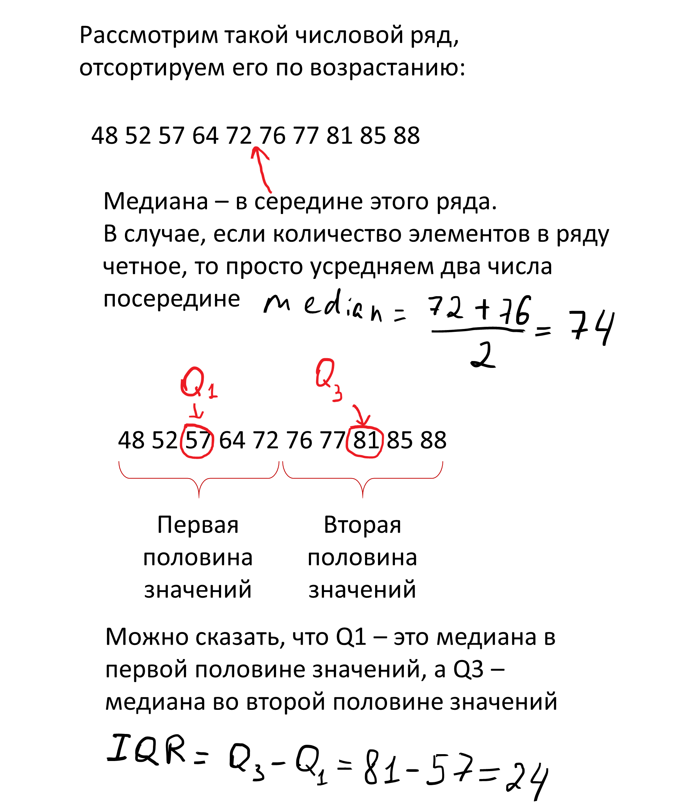
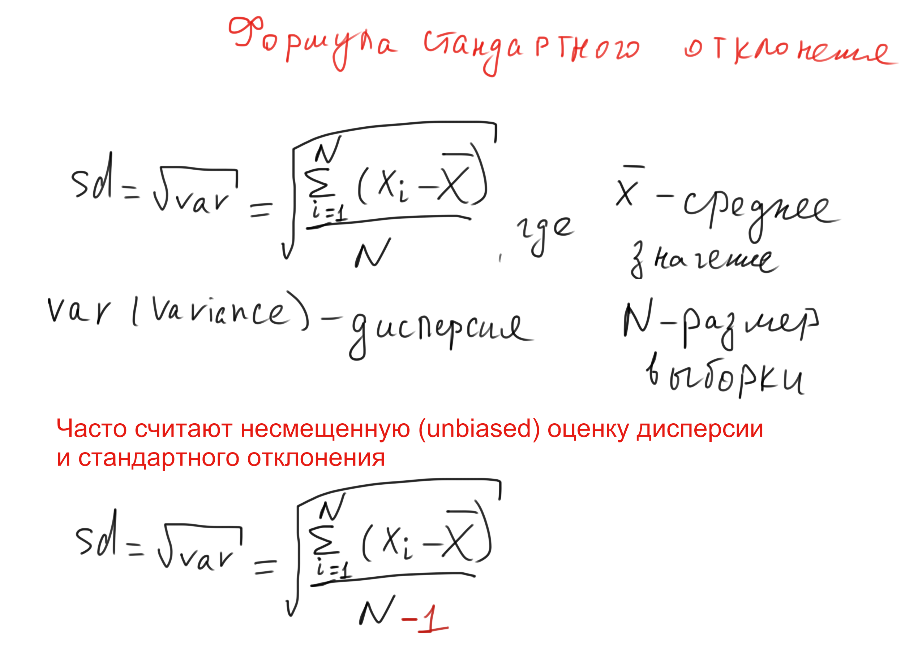

```{css, echo=FALSE}
.spoiler {
  visibility: hidden;
}

.spoiler::before {
  background-color: #d6d6d6;
  visibility: visible;
  content: "Spoiler alert!"
}

.spoiler:hover {
  visibility: visible;
}

.spoiler:hover::before {
  display: none;
}
```

Сегодня поговорим о различных видах пределов погрешностей или усов, как пишут в русскоязычной литературе (error bars).

*Предупреждаю сразу: по ходу повествования я буду использовать все варианты написания этого термина, даже слово эррор бар.*


Важно отметить, что существует два принципиально разных вида отображения пределов погрешностей на графике: 

* отражение описательных статистик (descriptive statistics);
* отражение статистик вывода (inferential statistics). 

Они выглядят на графике одинаково, но по факту фундаментально различны.
Давайте разбираться, в чем разница.

## Descriptive error bars

К описательным эррор барам относятся:

* Размах (range): разница между максимальным и минимальным значением в выборке (X~max~ - X~min~).
* Межквартильный размах (interquartile range, IQR): разница между третьм квартилем (Q~3~) и первым квартилем (Q~1~.).
* Стандартное отклонение (standard deviation, sd): квадратный корень из дисперсии.

**Размах** самая простая для понимания метрика, при этом редко использующаяся, поскольку сама по себе разница между максимальным и минимальным значением довольно-таки малоинформативна.

**Межквартильный размах (IQR)**, точнее 1.5\*IQR чаще всего используется на боксплотах (boxplot), я редко встречала 1\*IQR или 1.5\*IQR как усы к обычным барплотам.

*Барплот (barplot) - столбчатая диаграмма для категориальных данных, их будет много чуть дальше.*


Если расставить числа в ряд по возрастанию, то середина этого ряда - медиана (median) или второй квартиль (Q~2~). Первый квартиль (Q~1~) - значение, меньше которого 25% процентов данных, третий квартиль (Q~3~) - значение, меньше которого 75% данных.

Думаю, что на рисунке понять проще:

{width=75%}

Межквартильный размах намного чаще используется для визуализации, так как предоставляет больше информации о данных.

**Стандартное отклонение (standard deviation)** по-моему наиболее часто встречается в публикациях и на конференциях (по крайней мере в биологии), да и я обычно использую именно sd в качестве предела погрешностей.

Нарисовала небольшую схему про стандартное отклонение. Пока не сделала с детальным вычислением на реальных данных, поэтому пример пример можно посмотреть на [статквесте](https://www.youtube.com/watch?v=SzZ6GpcfoQY).




Важный момент! Все вышеописанные метрики отражают разброс значений в нашей **выборке**, без каких-либо предположений о происходящем в генеральной совокупности. В этом отличие от второго типа error bar.

## Inferential error bars

К эррор барам, отражающим статистики вывода относятся:

* Стандартная ошибка среднего (standard error, se)
* Доверительный интервал (confidence interval, CI)

Принципиальное отличие от описательных пределов погрешности в том, что грубо говоря, стандартная ошибка среднего/доверительный интервал пытаются отразить степень уверенности в поиске к примеру *истинного среднего* генеральной совокупности. В то время как описательные отражают, что происходит конкретно в *нашей выборке*.

Тут немного инфы для продвинутых (не открывайте, если не уверены, что хотите это знать!):

[Небольшое уточнение: с помощью бутстрепов можно оценивать не только доверительный интервал и стандартную ошибку для среднего, но и для медианы и даже для стандартного отклонения, но про это сейчас не будем]{.spoiler}


### Стандартная ошибка среднего
Теперь еще немного вымученных формулировок, которые попробую сформулировать понятнее.

Вымученная формулировка:
*The standard error (SE) of a statistic is the standard deviation of its sampling distribution or an estimate of that standard deviation.* (цитата прямо из [википедии](https://en.wikipedia.org/wiki/Standard_error))


Формула вычисления стандартной ошибки среднего очень простая - стандартное отклонение, деленное на квадратный корень из размера выборки. Но что на самом деле это значит, какой физический смысл стоит за результатом этого вычисления? Попробуйте сами ответить на этот вопрос, опираясь только на определение из википедии и формулу)

Теперь попробуем представить, что мы провели некий эксперимент, например измеряли вес 20 мышей после какого-либо воздействия и усредняли полученные значения. При этом мы решили 10 раз повторить свой эксперимент, в результате чего получили 10 средних значений. После этого мы можем посчитать среднее средних (!) и **стандартное отклонение средних**. Вот это стандартное отклонение выборочных средних и есть стандартная ошибка среднего. Ура? Пойду воспроизводить эксперимент по 10 раз?

Но мы не всегда (обычно никогда) можем себе позволить повторять эксперимент по 10 раз, и хитрость в том, что мы можем вычислить стандартную ошибку среднего без многократного повторения эксперимента, просто поделив стандартное отклонение на квадратный корень из размера выборки. 

Вот [тут](https://pozdniakov.github.io/tidy_stats/310-infer_stats.html#sec-sample_dist) хорошо расписано, как моделировать стандартную ошибку средних и что она действительно соответствует стандартному отклонению, деленному на квадратный корень из числа наблюдений.


Вот еще можно посмотреть про:

* отличия стандартного отклонения от стандартной ошибки https://www.youtube.com/watch?v=SzZ6GpcfoQY
* объяснение стандартной ошибки с бутстреп-примером https://www.youtube.com/watch?v=XNgt7F6FqDU&t=341s

В [статье](https://www.ncbi.nlm.nih.gov/pmc/articles/PMC2064100/), на которую я опиралась при написании этого материала, было указано, что для представления сравнения групп лучше использовать стандартную ошибку/доверительный интервал как error bar, а не стандартное отклонение и другие описательные статистики.

Но у меня есть неприятное подозрение, что для публикаций и представлений своей работы на конференциях некоторые недобросовестные ученые используют se, чтобы на графиках были усы поменьше. Однако, я не хочу обидеть тех, кто использует стандартную ошибку и понимает физический смысл. Интересно будет собрать примеры работ, где использование se оправданно и разумно, и где это не так, поэтому если есть примеры, то пишите в комментарии.

В целом, плюс именно se в том, что при отрисовке сравнений двух или нескольких групп, перекрываемость усов позволяет косвенно судить об отсутствии значимости различий (при этом обратное - нет, про это будет еще чуть дальше), в то время как sd и остальные описательные пределы погрешностей - нет. Однако sd показывает данные почти как они есть, то есть реальный разброс в наших данных, без предположений о генеральной совокупности, поэтому лично я предпочитаю sd для отрисовки. Это тоже интересная тема для дискуссии, буду рада обсудить в комментариях.

И наконец...

### Доверительный интервал

Если простыми словами, то доверительный интервал оценивает диапазон, в котором с заданной уверенностью (например 95%), можно ожидать истинное значение параметра, например среднего генеральной совокупности.

Прикрепляю формулу (зацените как я ее сверстала прямо в Rmarkdown):

$$\huge CI = \overline{x} ± z\frac{s}{\sqrt{n}}$$

Формула доверительного интервала (CI), $\overline{x}$ - среднее значение выборки, z - значение уровня достоверности, например для 95% уровня достоверности, $z = 1.96$, $\frac{s}{\sqrt{n}}$ - формула уже знакомой стандартной ошибки.


Вообще я не люблю эту тему, но к счастью уже существует немало источников, которые объяснили доверительный интервал разными способами: 

* В [книге](https://pozdniakov.github.io/tidy_stats/310-infer_stats.html#sec-ci_build) у Ивана объяснение доверительных интервалов классическим образом через формулу стандартной ошибки;

* Классное объяснение доверительных интервалов с помощью бутстрепа на [статквесте](https://www.youtube.com/watch?v=TqOeMYtOc1w&t=325s) (канал супер, всем рекомендую);

* Бонусом для тех, кому это все слишком просто: я нашла совершенно дикую статью про доверительные интервалы, доверительные полосы и доверительные эллипсы (sic!), поэтому кто желает преисполниться - велком (вот [ссылка](https://r-analytics.blogspot.com/2018/04/blog-post_28.html?m=1)). Краткого пересказа не будет, это надо прочитать самостоятельно.

Небольшой вывод. Отрисовка доверительных интервалов сейчас считается модной, якобы их проще интерпретировать. Но на самом деле доверительный интервал как и p-value - это один из тех концептов, которые провоцируют просто огромное количество мисинтерпретаций, это кстати одна из причин, по которой я их не люблю рассказывать. Важно сейчас отметить вот что:

, откуда картинка*](figures/se_overlap.png)

Таким образом, **перекрывание** стандартных ошибок говорит об **отсутствии** значимости в различии, при этом обратное не верно, а с доверительными интервалами наоборот - отсутствие перекрывания доверительных интервалов говорит о значимости различий, в то время обратное не верно.

В этом смысле мне нравится концепция стандартного отклонения, потому что их перекрывание или не перекрывание не говорит нам вообще ничего, а значит - нельзя запутаться).

**В любом случае, вне зависимости какой тип пределов погрешностей вы выбрали для отображения на графике, всегда нужно подписывать какой, потому что интерпретации совершенно разные.**

## А что если вообще не рисовать пределы погрешностей?

Если число значений в выборке невелико (например меньше 10), то лучше нарисовать все числа как они есть, например с помощью диаграммы рассеяния (scatter plot) без редуцирования информации в боксплоты или барплоты с пределами погрешностей.
Если значений больше, то возможно множество вариантов отрисовывания, часто исследователи используют просто барплоты с пределами погрешностей или боксплоты, однако здесь я предлагаю два возможных варианта более репрезентативного отображения данных.

Первый - это отрисовать violin plot (скрипичная диаграмма), но не просто, а с небольшим боксплотом внутри. Я эту идею подчерпнула на курсе бластима по R, мне показалось угарная идея, прикрепляю небольшой пример как это выглядит на примере данных `iris`. 

```{r, warning=FALSE, message=FALSE}
library(tidyverse)
violin_box <- iris %>% 
  ggplot(aes(x = Species, y = Sepal.Width))+
  geom_violin(aes(fill = Species))+
  geom_boxplot(width = 0.15, alpha = 0.8)+
  theme_bw()
violin_box
```

Второй вариант больше подойдет для относительно небольшого количества наблюдений, когда счет идет на десятки, но не на тысячи точек. Это комбинация боксплота и отображения точек как они есть с помощью `geom_jitter` в библиотеке ggplot2 

```{r}
box_point <- iris %>% 
  ggplot(aes(Species, Sepal.Width))+
  geom_boxplot()+
  geom_jitter(aes(colour = Species), 
              position = position_jitter(width = 0.3, height = 0),
              alpha = 0.6, size = 1.5)+
  theme_bw()
box_point
```

По моему прикольно получилось! Эти варианты визуализации содержат гораздо больше информации, сравните например с обычными боксплотами и барплотами (здесь как предел погрешности использовала стандартное отклонение).


```{r}
box <- iris %>% 
  ggplot(aes(Species, Sepal.Width, fill = Species))+
  geom_boxplot()+
  theme_bw()
bar <- iris %>% 
  group_by(Species) %>% 
  summarise(mean_PW = mean(Sepal.Width), sd_PW = sd(Sepal.Width)) %>% 
  ggplot(aes(Species, mean_PW, fill = Species))+
  geom_bar(stat = 'identity')+
  geom_errorbar(aes(ymin = mean_PW - sd_PW, ymax = mean_PW + sd_PW), width = 0.2)+
  labs(y = 'Mean Sepal Width')+
  theme_bw()
box
bar
```

А теперь все вместе на одном графике (обратите внимание на библиотеку `patchwork` для красивого объединения плотов на одном рисунке):

```{r}
library(patchwork)
p <- (violin_box + box_point) / (box + bar)
p + plot_annotation(tag_levels = 'A')
```
Голосуйте, какой плот больше нравится и является более информативным. Мне лично здесь нравится вариант B - box+точки, кажется наиболее информативным и красивым. Возможно, если наблюдений будет больше, то лучше окажется первый вариант с вайлином плотом и боксом.

А теперь визуализация трех основных пределов погрешностей: стандартного отклонения, стандартной ошибки и доверительных интервалов на данных `iris`.

```{r, warning=FALSE, message=FALSE}
library(data.table)
bar_se <- iris %>% 
  group_by(Species) %>% 
  summarise(mean_PW = mean(Sepal.Width), se_PW = sd(Sepal.Width)/sqrt(length(Sepal.Width))) %>% 
  ggplot(aes(Species, mean_PW, fill = Species))+
  geom_bar(stat = 'identity')+
  geom_errorbar(aes(ymin = mean_PW - se_PW, ymax = mean_PW + se_PW), width = 0.2)+
  labs(y = 'Mean Sepal Width')+
  ggtitle('Error bars are standard error')+
  theme_bw()
# bar_se

bar_CI <- iris %>% 
  group_by(Species) %>%
  summarise(n=n(), mean=mean(Sepal.Length), sd=sd(Sepal.Length)) %>%
  mutate(se = sd/sqrt(n))  %>%
  mutate(ic = se * qt((1-0.05)/2 + .5, n-1)) %>% 
  ggplot(aes(Species, mean, fill = Species))+
  geom_bar(stat = 'identity')+
  geom_errorbar(aes(ymin = mean - ic, ymax = mean + ic), width = 0.2)+
  labs(y = 'Mean Sepal Width')+
  ggtitle('Error bars are confidence intervals')+
  theme_bw()
# bar_CI
bar+ggtitle('Error bars are standard deviation') + bar_se + bar_CI+  plot_layout(ncol = 2)

```

Теперь я сделаю одну плохую вещь, а именно **просто** сравню тестом Стьюдента Sepal.Width для разных видов ириса. Как думаете, почему это плохо?

[Я в этом примере не делаю поправку на множественное тестирование]{.spoiler}

```{r}
iris %>% 
  setDT() 
cat('versicolor vs setosa: \np-value of the test', t.test(iris[Species == 'setosa', Sepal.Width], iris[Species == 'versicolor', Sepal.Width])$p.value)
cat('setosa vs virginica: \np-value of the test', t.test(iris[Species == 'setosa', Sepal.Width], iris[Species == 'virginica', Sepal.Width])$p.value)
cat('virginica vs versicolor: \np-value of the test', t.test(iris[Species == 'virginica', Sepal.Width], iris[Species == 'versicolor', Sepal.Width])$p.value)


```
Но один раз в жизни можно, только для демонстрации того, что все выборки значимо отличаются друг от друга (без поправки), и на графиках можно увидеть что доверительные интервалы не перекрываются.

Ура! Я дописала, а вы дочитали, с чем я всех и поздравляю) Теперь перейдем к выводам.   

## Выводы

1. Существует два типа отображения пределов погрешностей на графике: описательные, которые *описывают* значения в конкретно нашей выборке и inferential (так и не придумала как переводить), которые пытаются отразить что-то о генеральной совокупности с заданной долей уверенности.
2. Для отображения сравнений между группами рекомендуют использовать вторые, поскольку они позволяют делать выводы из перекрывания или не-перекрывания усов.
3. Однако, есть способы рисовать распределение наших значений без использования мисинтерпретируемых пределов погрешностей, например violin+boxplot и boxplot+точки


